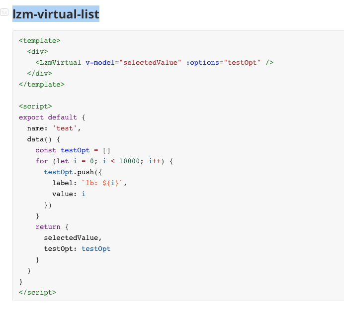

# lzm-virtual-select
a virtualList select component of vue2
## Install
```shell
npm i lzm-virtual-list
```

## Quick Start
``` javascript
import Vue from 'vue'
import LzmVirtual from 'lzm-virtual-list'

Vue.use(LzmVirtual)


```

## in Vue

